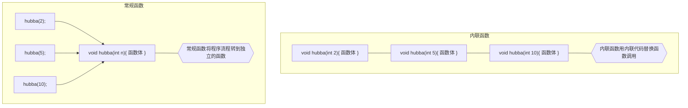

#### 1. 内联与宏

内联函数和常规函数一样是按值传递参数的，而宏不能按值传递。比如：

```cpp
#define SQUARE(X) X*X

a = SQUARE(4.5 + 7.5);// 展开为 -> 4.5 + 7.5 * 4.5 + 7.5
b = SQUARE(c++); // 展开为 -> c++ * c++
```

声明内联函数：

```cpp
inline double square(double x);
```

声明函数为 `inline` 只表示请求，编译器不一定会满足这种要求。它可能认为该函数过大或者注意到函数自己调用自己，因此不会将其作为内联函数。有且编译器则不会这样。




也就是说，编译器不是让程序跳到独立的代码段，以执行函数，而是用相应的代码替换函数调用。只有在 **函数很短** 时才能采用内联方式。

#### 2. 引用

**引用必须在声明时初始化**

```cpp
int rat;
int& rodent;
rodent = rat;// you can't do this
```

**引用更接近于 `const` 指针，一旦与一个变量关联起来，就将一直效忠于它**

```cpp
int rat = 5;

int& rodent = rat;
int* const pr = &rat;
```

**引用变量引用的是变量（左值）**，表达式等不能被引用

我们很容易就能发现下面的写法有问题：

```cpp
	int x = 3;
	int& rx = x + 3;
```

但是当函数参数为这种表达式时，可能不那么容易发现：

```cpp
double refcube(double& d)
{
    return d * d * d;
}

double x = 3.0;
refcube(x + 3);
```

**基类引用可以引用派生类对象**

##### 临时变量，引用参数和 const

引用作为函数形参时，如果引用参数为 `const`，则编译器将在下面两种情况下生成临时变量：

- 实参的类型正确，但不是左值
- 实参的类型不正确，但是可以转换成正确的类型

> 左值：变量，引用，被解引用的指针
>
> 右值：字面常量，多项表达式

请看下例：

```cpp
double refcube(const double& ra)
{
	return ra * ra * ra;
}

void test2()
{
	double side = 3.0;
	double* pd = &side;
	double& rd = side;
	long edge = 5L;
	double lens[4] = { 2.0, 5.0, 10.0, 12.0 };

	double c1 = refcube(side);
	double c1 = refcube(rd);
	double c1 = refcube(*pd);
	double c1 = refcube(lens[2]);
	double c1 = refcube(edge);
	double c1 = refcube(7.0);
	double c1 = refcube(side + 10.0);
}
```

参数 side,lens[2],rd,*pd 都是有名称的，double 类型的数据数据对象，因此可以为其创建引用，而不需要临时变量。edge 虽然是变量，类型不正确，double 类型的引用不能指向 long 类型的变量；参数 7.0 和 side + 10.0 虽然类型正确，但没有名称。在这些情况下，编译器都会生成一个临时匿名变量，并让 `ra` 指向它。**这些临时变量只在函数调用期间存在，此后编译器便可以随意将其删除。**

对于下面的函数：

```cpp
void swapr(int& a, int& b)
{
	int temp;

	temp = a;
	a = b;
	b = a;
}

void test3()
{
	long a = 3, b = 5;
	swapr(a, b);
}
```

在早期 C++ 较宽松的规则下：这里类型不匹配，因此编译器将创建两个临时的 int 变量，将他们初始化为 3 和 5，然后交换临时变量的内容，而 a 和 b 保持不变。

现在来看 `refcube()`函数。该函数的目的只是使用传递的值，而不是修改他们，因此临时变量不会造成任何不利的影响，反而会使函数在可处理的参数种类方面更通用。对于形参为 const 引用的 C++ 函数，如果实参不匹配，则其行为类似于按值传递。

**记住：** **如果函数调用的参数不是左值或与相应的 const 引用参数类型不匹配，则 C++ 将创建类型正确的匿名变量，将函数调用的（实际）参数的值传递给该匿名变量，并让（形式）参数来引用该变量。**


#####  尽可能的使用 const

将引用参数声明为常量数据的引用的理由有 3 个：

- 使用 const 可以避免无意中修改数据的编程错误
- 使用 const 可以处理 const 和 非 const 实参，否则将只能接受非 const 数据
- 使用 const 引用使函数可以正确生成并使用临时变量


##### 引用作为返回值

```cpp
struct sysop
{
	char name[26];
	char quote[64];
	int used;
};

// 返回值为 const，只能在接口中修改变量的值
const sysop& use(sysop& sysopref)
{
	cout << sysopref.name << " " << sysopref.quote << endl;
	++sysopref.used;
	return sysopref;
}

void test4()
{
	sysop looper = {
		"Shepard",
		"I'm handsome",
		0
	};
	
	cout << use(looper).name << endl;
    
    const sysop& rlooper = use(looper);
    cout << rlooper.quote << endl;
}
```

通常，返回机制将返回值复制到临时存储区域中，随后调用程序将访问该区域。

`use()`函数返回一个结构，`sysopref` 的内容将被复制到一个临时返回存储单元中，然后该临时返回存储单元的内容将被复制到 `rlooper` 中。然后，由于 use() 返回的是指向 looper 的引用，在这种情况下，looper的内容将被直接复制到 rlooper 中。这使得程序 **效率更高** 

**记住:** 返回引用的函数实际上返回的是被引用变量的别名。（比如上面的程序中 use 函数实际上返回的是 looper 的引用而不是 sysopref 的引用）


返回引用应**避免返回当函数终止时不再存在的内存单元的引用** 

为了避免这种问题，可以：

- 返回一个作为参数（引用参数）传递给函数的引用
- 用 new 来分配新的存储空间


为何将 const 用于引用返回类型？

返回 const 的引用只意味着你不能使用返回的引用来直接修改指向它的结构。

省略 const 后，便可以编写更简短但含义更模糊的代码。我们应该避免因为模糊而犯错的可能。


#### 3. 默认参数

对于带参数列表的函数，必须 **从右向左** 添加默认值。

实参按 **从左到右** 的顺序依次被赋值给相应的形参，而不能跳过任何参数。


**当一个函数有函数原型（声明）的时候，默认参数必须在原型中指定**，函数定义与没有默认参数是完全相同。

```cpp
char* left(const char* str, int len = 1);

void test5()
{
	const int size = 20;
	char* p = new char[size];

	cout << "Enter a string" << endl;
	cin.get(p, size);
	
	char* pp = left(p);
	cout << pp << endl;

	delete[] pp;

	pp = left(p, 3);
	cout << pp << endl;

	delete[] pp;
	delete[] p;
}

// 获取字符串的前 len 个字符
char* left(const char* str, int len)
{
	if (len < 0)
		len = 0;

	char* p = new char[len + 1];
	int i;
	
	// copy charactors
	for (i = 0; i < len && str[i]; i++)
		p[i] = str[i];
	// set the rest of the string to '\0'
	while (i <= len)
		p[i++] = '\0';

	return p;
}
```

上面的 `left()` 函数在确定存放字串数组的大小时：

```cpp
char* p = new char[len + 1];
```

直接使用传入的参数 `len` 作为数组的大小。如果出现了下面这种情况：

```cpp
left("hi", 32767);
```

程序会变得低效，一个解决办法是选择字符数组 `str` 的长度和 `len` 中的较小值加一作为数组的大小。

```cpp
int n = strlen(str);
len = n > len ? len : n;
```

但是由于 `strlen()` 函数的调用，程序的效率会降低，同时还必须要包含 `cstring` 头文件。所以，我们可以自己来写比较 str 长度和 len 大小的代码：

```cpp
int size = 0;
while(str[size] && size < len)
    ++size;
```


#### 4. 函数重载

##### 函数特征标

```cpp
double add(double a, int b)
{
	return a + b;
}

double add(int a, double b)
{
	return a + b;
}

void test6()
{
	cout << add(1, 1.0) << endl;
}
```

> 函数重载（function overloading） 是 C++ 多态（polymorphism）的一种表现形式。
>
> 函数重载的关键是 **函数的参数列表** ，也成为 **函数特征标**（function signature）

区分函数是否重载的条件：

- 参数顺序
- 参数个数
- 参数类型

##### 函数重载的一个注意点

使用被重载的函数时，需要在函数调用中使用正确的参数类型。下面的调用：

```cpp
add(1, 1);
```

`add()` 的调用与那个原型匹配呢？它与哪一个原型都不匹配！虽然没有匹配的原型，但是 C++ 有强制类型转换呀，可惜的是，因为 add 是重载函数，而 `add(int, int)` 有多个可以转换的原型，在这种情况下，C++ 将拒绝这种函数调用，并将其视为错误。

如果我们再增加一个 add 的重载函数，然后这样调用：

```cpp
double add(const char* str, int size)
{
	return size;
}

void test6()
{
	cout << add("hello", 2.0) << endl;
}
```

此时，add 的重载函数中只有一个可以与之匹配，double 类型的 2.0 就会强制转换为 int 类型了，从而调用该重载函数。


##### 不构成重载的情况

```cpp
double add(int x);
double add(int& x);
```

类型本身和类型引用 **不构成重载** 。

参数 `x` 与 `int x` 和 `int& x` 都匹配，因此编译器无法确定应该使用哪一个。 


```cpp
double add(const char* x);
double add(char* x);
```

上面这一组是 **构成重载** 的。

编译器会根据实参选择相应的函数。

需要注意的是，形参带 const ，实参可以是 const 也可以不是；但是如果形参不带 const，实参必须不能带 const。比如下面这种写法就是错误的：

```cpp
double add(char* x);

const char str[] = "Shepard";
add(str); // error
```

再来看下面这种函数特征标相同而函数返回值不同的情况：

```cpp
double add(int x);
int add(int x);
```

这是 **不构成重载** 的。


现在我们可以写一个计算左边 n 位数字的 left 函数，与前面的 `left` 函数构成重载：

```cpp
// This function return the first cnt digits of the number num
unsigned long left(unsigned long num, size_t cnt)
{
	if (cnt == 0 || num == 0)
		return 0;

	// 计算出这个数的位数
	size_t digit = 1;
	unsigned long int n = num;

	while (n /= 10)
		digit++;

	if (digit > cnt)
	{
		// 获取 digit 位数字的前 cnt 位
		cnt = digit - cnt;
		while (cnt--)
			num /= 10;
		return num;
	}
	else
		return num;
}

void test7()
{
	unsigned long int ul = 12345678;
	const char* str = "Shepard";

	for (int i = 0; i < 10; i++)
	{
		cout << left(ul, i) << " ";
		char* p = left(str, i);
		cout << p << endl;

		delete[] p;
	}
}

打印：
0
1 S
12 Sh
123 She
1234 Shep
12345 Shepa
123456 Shepar
1234567 Shepard
12345678 Shepard
12345678 Shepard
```


不要滥用重载函数。

前面第一个 `left()` 函数可以改写为：

```cpp
char* left(const char* str, int len);
char* left(const char* str)
```


#### 5. 函数模板

##### typename 和 class 的区别

如果不考虑向后兼容的问题（有大量的代码库是使用 class 关键词开发的），并愿意键入较长的单词，则声明类型参数时，应使用关键字 `typename` 而不是用 `class`

**总结： ** 写 `class` 就完事了。

使用模板函数前提供模板函数的原型和定义：

```cpp
// 模板原型
template<class T>
void swap(T& a, T& b);

int main()
{
	...
}

// 模板定义
template<class T>
void swap(T& a, T& b)
{
	T temp;
	temp = a;
	a = b;
	b = temp;
}
```

**模板的好处：** 使得生成多个函数定义更加简单，可靠。

模板函数重载：

```cpp
// 模板函数的重载
template<class T>
void swap(T* a, T* b, int n);
```


##### 显式具体化（特化）

ISO/ANSI C++ 标准：

- 对于给定的函数名，可以有非模板函数，模板函数和显式具体化模板函数以及他们的重载版本。
- 显式具体化的原型和定义应该以 `template<>` 打头，并通过名称来指出类型
- 具体化将覆盖常规模板，而非模板函数将覆盖具体化和常规模板。

```cpp
// 显示具体化（特化）
struct job
{
	char name[40];
	double salary;
	int floor;
};

// non-template function prototype
void swap(job&, job&);

// template prototype
template<class T>
void swap(T&, T&);

// explicit specialization for the job type
template<>
void swap<job>(job&, job&);
//可写作
template<>
void swap(job&, job&);
```

.

```cpp
// 注意：Swap 不要写成 swap 这样就和 std::swap 重名了！！！
struct job
{
	char name[40];
	double salary;
	int floor;
};

template<class T>
void Swap(T& a, T& b);

template<>
void Swap<job>(job& j1, job& j2);

void show(job& j);

void test8()
{
	int a = 5, b = 13;

	Swap(a, b);

	cout << "a = " << a << " b = " << b << endl;

	job j1 = {
		"programmer",
		20000,
		5
	};

	job j2 = {
		"product manager",
		15000,
		100
	};

	Swap(j1, j2);

	show(j1);
	show(j2);
}

template<class T>
void Swap(T& a, T& b)
{
	T temp;
	temp = a;
	a = b;
	b = temp;
}

template<>
void Swap<job>(job& a, job& b)
{
	double d;
	int i;

	d = a.salary;
	a.salary = b.salary;
	b.salary = d;

	i = a.floor;
	a.floor = b.floor;
	b.floor = i;
}

void show(job& j)
{
	cout << j.name << " " << j.salary << " " << j.floor << endl;
}
```


##### 实例化和具体化的区别

具体化我们前面提过，它的含义是：

> 不要使用 `Swap()` 模板来生成函数，而应该使用独立的，专门的函数定义显示的为 job 类型生成函数定义

实例化（instantiation）

> 编译器为特定类型生成函数定义时，得到的是模板实例。

`Swap(a, b)` 这类成为隐式实例化（implicit instantiation）

而显示实例化（explict instantiation）为 `Swap<int>(a, b)` 

隐式实例化，显示实例化，显示具体化统称为具体化（specialization）。他们的共同之处在于：**他们表示的都是使用具体类型的函数定义，而不是通用描述** 

##### 编译器选择使用那个函数版本

对于函数重载，函数模板和函数模板重载，C++ 需要（且有）一个定义良好的策略，来决定为函数调用提供哪一个函数定义，尤其是多个参数时。这个过程称为 **重载解析** （overloading resolution）。

可行函数最佳到最差：

- 完全匹配。但常规函数优于模板
- 提升转换。（例如，char，short 转换为 int；float 转换为 double）
- 标准转换。（例如，int 转换为 char，long 转换为 double）
- 用户定义的转换。

完全匹配允许的无关紧要的转换：(`Type` 表示任意类型)

| 从实参                | 到形参                    | 从实参  | 到形参           |
| --------------------- | ------------------------- | ------- | ---------------- |
| `Type`                | `Type&`                   | `Type`  | `const Type`     |
| `Type&`               | `Type`                    | `Type`  | `volatile Type`  |
| `Type[]`              | `Type*`                   | `Type*` | `const Type*`    |
| `Type(argument-list)` | `Type(*) (argument-list)` | `Type*` | `volatile Type*` |

对于模板函数来说：


**最具体** （most specialized）是指编译器推断使用哪种类型时执行的转换最少。

例如：

```cpp
// 模板 1
template<class T>
void recycle(T t); 
// 模板 2
template<class T>
void recycle(T* t);

int a = 10;
recycle(&a);
```

`recycle(&a)` 调用与模板 1 匹配，`T` 被解释为 `int*`；若与模板 2 匹配，`T` 被解释为 `int` 

可见，模板 2 是更为 ”具体“ 的，因为在生成的过程中，它需要进行的转换更少。

**总结：**

> 简而言之，重载解析将寻找最匹配的函数。如果只存在一个这样的函数，则选择它；如果存在多个这样的函数，但其中只有一个是非模板函数，则选择该函数;如果存在多个适合的函数，并且它们都为模板函数，但其中有一个函数比其他函数更具体，则选择该函数。
>
> 如果有多个同样合适的非模板函数或模板函数，但没有一个函数比其他函数更具体，则函数调用将是不确定的，因此是错误的。当然，如果不存在匹配的函数，则也是错误的。


