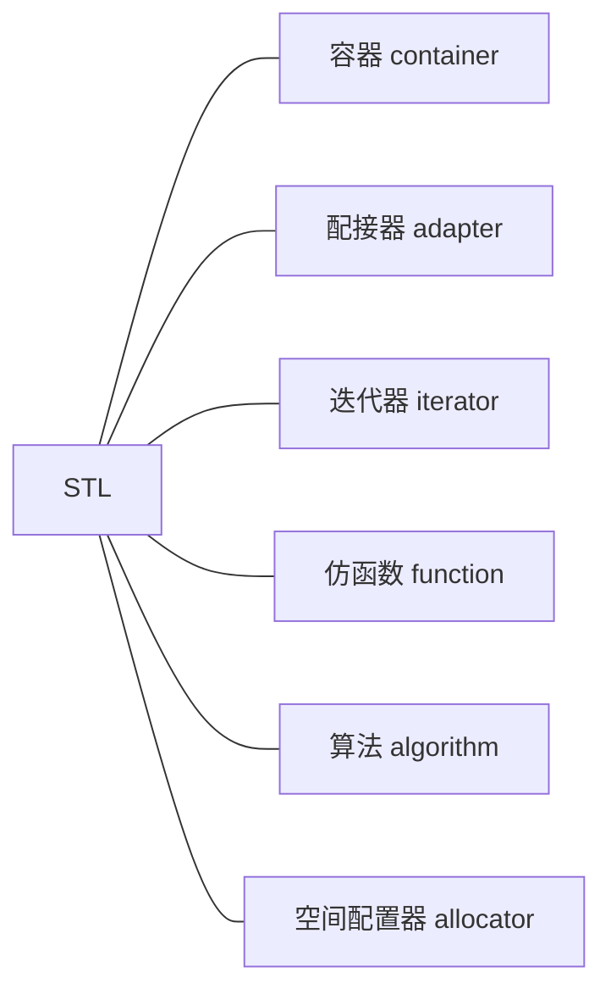
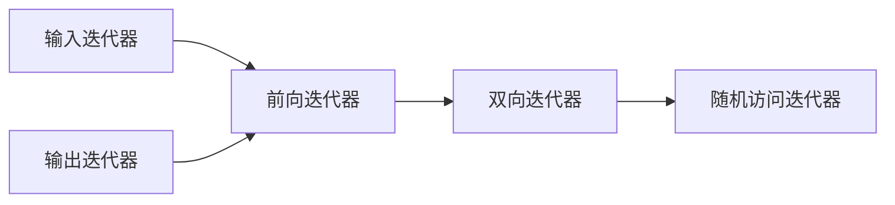

### 一 STL 组成 




### 二 常用容器 


.png)


#### 容器简介

下面我们来简单看一下这些容器的常用接口的使用，并分析其复杂度

#### vector

.png)


#### list

.png)


#### deque

.png)


#### stack

.png)


#### queue

.png)


#### priority_queue

.png)


#### set & multiset

.png)


#### map & multimap 

.png)


#### unordered_map & unordered_multimap

|            | unordered_map             |
| ---------- | ------------------------- |
| 底层实现： | 动态数组 + 链表（红黑树） |
| 查找：     | `find()`                  |
| 计数：     | `count()`                 |
| 指定插入： | `insert()`                |
| 指定删除： | `erase()`                 |
| 随机访问   | `operator[]`              |

由于底层实现哈希表的时候，会有负载因子的存在，所以可以认为上述操作的复杂度都为 `O(1)`

如果哈希冲突比较多，可以采用 动态数组 + 红黑树实现，复杂度最多为 `O(logn)` 

因此，哈希表的优势为 `O(1)` 的查找；这是一种以空间换时间的策略。


#### 容器选择

- 不知道使用什么容器时，优先选择 `vector` 

- 如果不需要频繁的任意位置插入，需要支持随机访问，选择 `vector`

- 如果不需要随机访问，需要频繁的插入，选择 `list` 

- 如果需要频繁的对头/尾操作，选择 `deque`

- 如果需要高效的查找，但对内存没有限制，可以选择 `unordered_map` ；如果对内存有限制，可以选择 `set/map` 

- `deque` 在 STL 中作为 `stack` 和 `queue` 底层实现。其优势为：

  - 相比于 `vector` ：头部插入和删除以及扩容时，效率更高，因为不需要搬大量的元素
  - 相比于 `list`：底层空间更为连续，空间利用率更高

  劣势为：不适合遍历，因为在遍历时，`deque` 的迭代器要频繁的去检测其是否移动到某段小空间的边界，导致效率低下


### 三 迭代器

#### 1. 迭代器种类

*迭代器种类一节摘自：* [Stl整理](https://wu-kan.cn/_posts/2019-04-20-STL%E6%95%B4%E7%90%86/#%E7%AE%97%E6%B3%95%E6%A6%82%E8%A7%88) 

 C++中，一图解释五类迭代器之间的继承关系：





##### 输入迭代器（input iterator）

只读，不写；单遍扫描，只能递增。

输入迭代器只支持顺序访问，通常用于读取序列中的元素。对于一个输入迭代器`it`，`*it++`保证是有效的，但递增它可能导致所有其他指向流的迭代器失效。其结果就是，不保证其状态可以保存下来并用来访问元素。因此，输入迭代器只能用于单遍扫描的算法。支持如下操作：

- 相等（`==`）、不等（`!=`）比较。
- 用于推进迭代器的前置和后置递增（`++`）。
- 解引用（`*`），只能出现在赋值运算的右侧；箭头运算符（`->`），`it->member`等价于`(*it).member`。

算法`find`要求输入迭代器；而类型`istream_iterator`是一种输入迭代器。

##### 输出迭代器（output iterator）

只写，不读；单遍扫描，只能递增。可以看作输入迭代器功能上的补集。

只能向解引用的输出迭代器赋值一次，类似输入迭代器，输出迭代器也只能用于单遍扫描的算法，通常用作算法的目标位置。支持如下操作：

- 用于推进迭代器的前置和后置递增（`++`）。
- 解引用（`*`），只能出现在赋值运算的左侧。

算法`fill`要求输出迭代器；而类型`ostream_iterator`是一种输出迭代器。

##### 前向迭代器（forward iterator）

可读写；多遍扫描，只能递增。

可以读写元素，只能在序列中沿着一个方向移动，支持所有输入迭代器和输出迭代器的操作，而且可以多次读写同一个元素。因此，可以保存前向迭代器的状态，使用前向迭代器的算法可以进行多遍扫描。

算法`replace`要求前向迭代器；容器`forward_list`上的迭代器是前向迭代器。

##### 双向迭代器（bidrectional iterator）

可读写；多遍扫描，能递增递减。

可正向/反向读写序列中的元素。除支持所有前向迭代器的操作之外，双向迭代器还支持前置和后置递减（`--`）。

算法`reverse`要求双向迭代器；除了`forward_list`之外，其他标准库容器上的迭代器都是双向迭代器。

##### 随机访问迭代器（random-access iterator）

可读写；多遍扫描，支持全部迭代器运算。

提供在常数时间内访问序列中任意元素的能力，除支持双向迭代器的所有操作外，还支持：

- 用于比较两个迭代器的相对位置（`>`、`<`、`>=`、`<=`）。
- 迭代器和一个整数值的加减运算（`+`、`+=`、`-`、`-=`），计算结果迭代器在序列中前进或后退给定整数后的迭代器。
- 迭代器之间的减法（`-`），得到两个迭代器之间的距离。
- 下标运算符（`[]`），`it[n]`与`*(it+n)`等价。

算法`sort`要求随机访问迭代器；容器`vector`上的迭代器和用于访问内置数组的指针是随机访问迭代器。


#### 2. 迭代器失效

图片来源 cppreference

.png)


#### 3. 迭代器实现 

以下都是迭代器的简单实现，要看对容器的完整实现，请去我的 Github，链接如下：

> https://github.com/hairrrrr/Cpp-Primer 
>
> 记得留下你的 star 哟~

##### deque


简单实现：

```cpp
template<class T,...>
struct __deque_iterator{
    ...
    T* cur;
    T* first;
    T* last;
    map_pointer node;//map_pointer 等价于 T**
}

//当迭代器处于当前连续空间边缘的位置时，如果继续遍历，就需要跳跃到其它的连续空间中，该函数可用来实现此功能
void set_node(map_pointer new_node){
    node = new_node;//记录新的连续空间在 map 数组中的位置
    first = *new_node; //更新 first 指针
    //更新 last 指针，difference_type(buffer_size())表示每段连续空间的长度
    last = first + difference_type(buffer_size());
}
//重载 * 运算符
reference operator*() const{return *cur;}
pointer operator->() const{return &(operator *());}
//重载前置 ++ 运算符
self & operator++(){
    ++cur;
    //处理 cur 处于连续空间边缘的特殊情况
    if(cur == last){
        //调用该函数，将迭代器跳跃到下一个连续空间中
        set_node(node+1);
        //对 cur 重新赋值
        cur = first;
    }
    return *this;
}
//重置前置 -- 运算符
self& operator--(){
    //如果 cur 位于连续空间边缘，则先将迭代器跳跃到前一个连续空间中
    if(cur == first){
        set_node(node-1);
        cur == last;
    }
    --cur;
    return *this;
}
```


##### list

```cpp
/**
 * ListNode: 链表的节点类型
 */
template<class T>
struct ListNode
{
	T _value;
	ListNode* _next;
	ListNode* _prev;

	ListNode(const T& val = T())
		:_value(val)
		,_next(nullptr)
		,_prev(nullptr)
	{}
};


/**
 * ListIterator: 链表的迭代器
 * 类类型的迭代器不是指针，而是一个类。
 * 各种操作其实本质是操作 ListNode 中的某个成员
 */
template<class T, class Ref, class Ptr>
struct ListIterator
{
	typedef ListNode<T> Node;
	typedef ListIterator<T, Ref, Ptr> Self;

	ListIterator(Node* node)
		:_node(node)
	{}

	Ref operator*()
	{
		return _node->_value;
	}
	
	/** 
	 *	-> 当作单目运算符处理
	 *	类类型中的元素访问模式：ListNode->_val->某一个元素
	 *	中间的 ->_val 被编译器优化
	 */
	Ptr operator->()
	{
		return &_node->_value;
	}

	Self& operator++()
	{
		_node = _node->_next;
		return *this;
	}

	Self& operator--()
	{
		_node = _node->_prev;
		return *this;
	}

	bool operator!=(const Self& it)
	{
		return _node != it._node;
	}

	Node* _node;
};
```


因为 map & set & multimap & multiset 底层都是用红黑树实现的，因此，我们有必要看一下红黑树的迭代器如何实现。

##### 红黑树

```cpp
template<class Value>
struct RBNode
{
	typedef RBNode<Value>* Ptr_RBNode;

	Value _data;
	Color _color;
	Ptr_RBNode _left;
	Ptr_RBNode _right;
	Ptr_RBNode _parent;

	RBNode(const Value& data = Value())
		:_data(data)
		,_color(RED) // 节点颜色默认初始化为 red
		,_left(nullptr)
		,_right(nullptr)
		,_parent(nullptr)
	{}
};

template<class Value>
struct RBIterator
{
	typedef RBNode<Value> Node;
	typedef RBIterator Self;

	Node* _node;

	RBIterator(Node* node)
		:_node(node)
	{}

	Value& operator*()
	{
		return _node->_data;
	}

	Value* operator->()
	{
		return &_node->_data;
	}

	bool operator==(const Self& it)
	{
		return _node == it._node;
	}

	bool operator!=(const Self& it)
	{
		return _node != it._node;
	}

	Self& operator++()
	{
		// 如果当前节点有右节点
		if (_node->_right)
		{
			_node = _node->_right;
			// 让 _node 设为最右节点
			while (_node->_left)
				_node = _node->_left;
		}
		// 向上回溯，如果当前节点为父节点的右节点，继续向上回溯
		else
		{
			Node* parent = _node->_parent;
			while (_node == parent->_right)
			{
				_node = parent;
				parent = parent->_parent;
			}
			// 当 parent 为 _header ,_node 为整个树的根节点时，
			// 一定会退出上面的 while 循环,此时应该将 _node 置为 _header
			// 如果 _node 不在父节点的左侧，也应该单独执行一次，将 _node 指向下一次访问的节点
			/*_node = parent;*/
			// 上面的写法有一个问题，如果整个树只有一个节点。_header->right == _node
			// _node 会走到 _header, parent 走到 _node 此时退出循环
			// _node 再被赋值为 _node , 所以迭代器的遍历会陷入循环
			if (_node->_right != parent)
				_node = parent;
		}

		return *this;
	}
};
```


map 和 set 的迭代器只是对红黑树的迭代器进行了封装，然后给出了 `begin()` 和 `end()` 方法。


##### 哈希表

```cpp
template<class K, class V, class keyOfValue, class HashFun>
struct HashIterator
{
	typedef HashNode<V> Node;
	typedef HashTable<K, V, keyOfValue, HashFun> _HashTable;
	typedef HashIterator<K, V, keyOfValue, HashFun> Self;

	Node* _node;
	_HashTable* _ht;

	HashIterator( Node* node,  _HashTable* ht)
		:_node(node)
		,_ht(ht)
	{}

	V& operator*() const 
	{
		return _node->_value;
	}

	V* operator->() const
	{
		return &_node->_value;
	}

	bool operator!=(const Self& it) const
	{
		return _node != it._node;
	}

	Self& operator++()  
	{
		// 如果 _node._next 存在
		if (_node->_next != nullptr)
		{
			_node = _node->_next;
		}
		// 在哈希表中向后寻找非空链表
		else
		{
			keyOfValue kov;
			HashFun hf;

			int idx = hf(kov(_node->_value)) % _ht->_table.size();

			idx++;
			for (; idx < _ht->_table.size(); idx++)
			{
				if (_ht->_table[idx])
				{
					_node = _ht->_table[idx];
					break;
				}
			}
			// 哈希表已遍历完
			if (idx == _ht->_table.size())
			 _node = nullptr;

			return *this;
		}
	}
};
```


### 四 仿函数

`priority_queue` 默认是一个“大根堆”，使用如下代码测试：

```cpp
int main(void)
{
	priority_queue<int> pq;

	pq.push(9);
	pq.push(5);
	pq.push(2);
	pq.push(7);

	while (!pq.empty())
	{
		cout << pq.top() << endl;
		pq.pop();
	}
}
```

输出：

```
9
7
5
2
```

如果我们想要堆中最小的元素，也就是建立一个“小根堆”，可以通过这种方式定义 pq：

```cpp
priority_queue<int, vector<int>, greater<int>> pq;
```

第二个参数表示 `priority_queue` 内部的实现方式，第三个参数定义了比较规则

我们也可以自己来定义比较规则：

```cpp
template<class T>
struct MyGreater : public binary_function<T, T, bool>
{
	bool operator()(const T& lhs, const T& rhs)
	{
		return lhs > rhs;
	}
};
```

然后通过如下方式调用：

```cpp
priority_queue<int, vector<int>, MyGreater<int>> pq;
```


### 五 空间配置器

未完待续。。。


### 六 算法

未完待续。。。


**参考文章：**

[C++ STL deque容器底层实现原理（深度剖析）](http://c.biancheng.net/view/6908.html)  

[竞赛常用STL容器详解](https://blog.csdn.net/weixin_43844677/article/details/104902417)

[Stl整理](https://wu-kan.cn/_posts/2019-04-20-STL%E6%95%B4%E7%90%86/#%E7%AE%97%E6%B3%95%E6%A6%82%E8%A7%88)


> C++ 学习代码仓库：https://github.com/hairrrrr/Cpp-Primer 
>
> C 语言学习代码仓库：https://github.com/hairrrrr/C-CrashCourse


