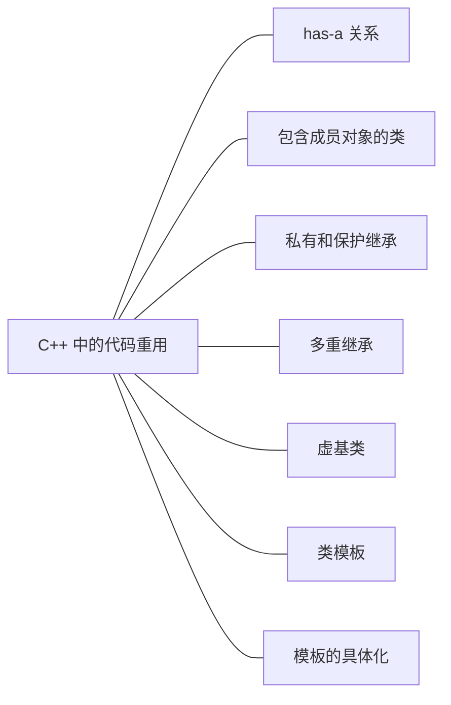

### 一 has-a 关系

> [`valarray`](http://cplusplus.com/reference/valarray/valarray/?kw=valarray)：顾名思义，这个模板类用来处理数值（或具有类似特性的类）

下面是这个类的一些方法：

- `operator[]`
- `size`
- `sum`
- `max`
- `min`

#### student 类设计

.png)


[代码练习1](https://github.com/hairrrrr/Cpp-Primer/tree/master/Code/Book/C%2B%2B%20Primer%20Plus/14_C%2B%2B%E4%B8%AD%E7%9A%84%E4%BB%A3%E7%A0%81%E9%87%8D%E7%94%A8/01_Student)


使用私有继承实现 `has-a`：

.png)

[代码练习2](https://github.com/hairrrrr/Cpp-Primer/tree/master/Code/Book/C%2B%2B%20Primer%20Plus/14_C%2B%2B%E4%B8%AD%E7%9A%84%E4%BB%A3%E7%A0%81%E9%87%8D%E7%94%A8/02_Student2)

`Student` 类继承了 `string` 和 `valarray` 两个类，两个类可能有同名的方法，这样在调用时，可能会出现二义性。

一个处理的方法是：string 并不需要 `operator[]` ，我们可以显式的定义一个 `Student` 类的 `operator[]` 函数实现对 `valarray` 的访问，并覆盖父类的同名函数。这样我们就可以直接使用子类对象调用自己的函数完成对 继承来的 `valarray` 的元素访问。

```cpp
// 显式定义
double& Student::operator[](int i)
{
	return ArrayDb::operator[](i);
}

double Student::operator[](int i) const
{
	return  ArrayDb::operator[](i);
}

std::istream& operator>>(std::istream& is, Student& s)
{
	std::cout << "请输入姓名：";
	getline(is, (string&)s);

	std::cout << "请输入 " << ArrayDb(s).size() << " 门成绩: ";
	for (int i = 0; i < s.size(); i++)
	{
        // 直接使用
		is >> s[i];
	}

	// 读取缓冲区中的剩余字符（包含 \n），如果不读，getline 会有问题
	while (std::cin.get() != '\n')
		;
	
	return is;
}
```


还有一种方式，我们可以不定义 `operator[]` 函数，直接使用 `using` 将 `valarray` 中的 `operator[]` 包含到 `Student` 类的公有部分：

```cpp
class Student
{
public:
using Student::valarray<double>::operator[];
// 或者：
using valarray<double>::operator[];
}
```

这样就可以直接在类外使用`对象[下标]`访问 `valarray` 中的元素。


**总结：**

> 通常应该使用 **包含** 来建立 `has-a` 关系；如果新类需要访问原有类的保护成员，或者需要重新定义虚函数，则应该使用私有继承。


### 二 多重继承

> multiple inheritance 简称 MI 

.png)

.png)

.png)


#### 1. 那个方法

.png)

```cpp
sw.Singer::show(); // 显式指定
```

还可以在 `SingingWaiter` 中重新定义 `show` 并指定要使用哪一个 `show` ：

```cpp
class SingingWaiter
{
    public:
    void show()
    {
        Singer::show();
	}
}
```


### 三 类模板

#### 1. 定义类模板

```cpp
#ifndef STACK_H_
#define STACK_H_

template<class T>
class Stack
{
private:
	enum{NUM = 10};
	T _s[NUM];
	int _top;
public:
	Stack()
		:_top(-1)
	{}

	bool IsEmpty() const;
	bool IsFull() const;
	bool push(T&& val);
	bool push(const T& val);
	T& top();
	bool pop();
};

template<class T>
bool Stack<T>::IsEmpty() const
{
	return _top == -1;
}

template<class T>
bool Stack<T>::IsFull() const
{
	return _top == NUM - 1;
}

template<class T>
bool Stack<T>::push(const T& val)
{
	if (!IsFull())
	{
		_s[++_top] = val;
		return true;
	}
	return false;
}

template<class T>
bool Stack<T>::push(T&& val)
{
	if (!IsFull())
	{
		_s[++_top] = val;
		return true;
	}
	return false;
}

template<class T>
T& Stack<T>::top()
{
	return _s[_top];
}

template<class T>
bool Stack<T>::pop()
{
	if (!IsEmpty())
	{
		--_top;
		return true;
	}
	return false;
}

#endif 
```

前面我们在定义类时，都是将类的声明放在 `.h` 文件中，然后将类的定义放在 `.cpp` 文件中进行分离编译。而定义类模板时，我们将类的声明和定义都放在了 `.h`文件中。

一定要这样写吗？如果我们将类的声明和定义分开，会发生什么？我们会得到 **连接错误** 的报错，为什么会这样呢？

详情参考文章：[为什么C++编译器不能支持对模板的分离式编译](https://blog.csdn.net/pongba/article/details/19130)


**指针栈实现**

```cpp
#ifndef STACK_H_
#define STACK_H_

template<class T>
class Stack
{
private:
	enum{NUM = 5};
	int _size; // 栈大小
	// 为 _s 分配内存是需要用到 _size，因此，_size 应该写在 _s 之前（初始化列表的顺序）
	T* _s;
	int _top;
public:
	// 单参构造函数，记得可以使用 explicit 
	explicit Stack(int size = NUM);
	Stack(const Stack<T>& s);
	Stack<T>& operator=(const Stack<T>& s);
	~Stack() { delete[] _s; };

	bool IsEmpty() const;
	bool IsFull() const;
	bool push(const T& val);
	T& top();
	bool pop();
};

template<class T>
Stack<T>::Stack(int size)
	:_top(-1)
	,_size(size)
	,_s(new T[_size])
{}

template<class T>
Stack<T>::Stack(const Stack<T>& s)
	:_top(s._top)
	,_size(s._size)
	,_s(new T[_size])
{
	for (int i = 0; i < _size; i++)
		_s[i] = s._s[i];
}

template<class T>
Stack<T>& Stack<T>::operator=(const Stack<T>& s)
{
	if (this != &s)
	{
		delete[] _s;
		_top = s._top;
		_size = s._size;
		_s = new T[_size];
		for (int i = 0; i < _size; i++)
			_s[i] = s._s[i];
	}
	return *this;
}

template<class T>
bool Stack<T>::IsEmpty() const
{
	return _top == -1;
}

template<class T>
bool Stack<T>::IsFull() const
{
	return _top == _size - 1;
}

template<class T>
bool Stack<T>::push(const T& val)
{
	if (!IsFull())
	{
		_s[++_top] = val;
		return true;
	}
	return false;
}


template<class T>
T& Stack<T>::top()
{
	return _s[_top];
}

template<class T>
bool Stack<T>::pop()
{
	if (!IsEmpty())
	{
		--_top;
		return true;
	}
	return false;
}

#endif 
```


- 使用初始化列表时，初始化的顺序和成员在初始化列表的顺序无关，**与声明的顺序有关** 。如果这样声明，然后使用初始化列表初始化：

  ```cpp
  private:
  	enum{NUM = 5};
  	T* _s;
  	int _top;
  	int _size; // 因为 _size 是我们新增的记录栈的大小的成员，所以很容易直接加在后面
  
  template<class T>
  Stack<T>::Stack(int size)
  	:_top(-1)
  	,_size(size)
  	,_s(new T[_size]) // 第一个被初始化，此时 _size 没有被初始化，_size 是一个随机值！！
  {}
  
  ```

- 我们的这种实现，对于有资源的类也是适用的（比如 string）。这是因为我们在写复制构造和赋值运算符重载函数时有这样一个循环：

  ```cpp
  	for (int i = 0; i < _size; i++)
  		_s[i] = s._s[i];
  ```

  这其实走的就是深拷贝的逻辑。

下面看一个案例：

```cpp
#include"stack.h"
#include<iostream>
#include<ctime>
#include<cstdlib>

const int NUM = 5;

int main()
{
	std::srand(std::time(0));

	Stack<const char*> st;

	const char* in[NUM] = {
		"1. He who has health has hope",
		"2. A rolling stone gathers no moss",
		"3. It never rains but pours",
		"4. Look before you leap",
		"5. Habit is second nature",
	};
	
	const char* out[NUM];

	int processed = 0;
	int nextin = 0;

	while (processed < NUM)
	{
		// 如果栈为空，入栈
		if (st.IsEmpty())
			st.push(in[nextin++]);
		// 如果栈为空，出栈
		else if (st.IsFull())
		{
			out[processed++] = st.top();
			st.pop();
		}
		// 栈非空，非满。随机执行入栈出栈操作
		else if (std::rand() % 2 && nextin < NUM)
			st.push(in[nextin++]);
		else
		{
			out[processed++] = st.top();
			st.pop();
		}
	}

	for (int i = 0; i < NUM; i++)
		std::cout << out[i] << std::endl;

	return 0;
}
```

使用 `const char*` 作为模板类型，创建出来的动态数组的类型为：

```cpp
const char** _s; // 先当与 const char* _s[]
```

我们再来看入栈的操作：

```cpp
st.push(in[nextin++]); //压入栈的是指针

_s[top++] = val; // 保留的是 const char* 指针
```

> 本例中是浅拷贝，字符串本身不会移动。把字符串压入堆栈实际上是新建一个指向该字符串的指针，该指针是现有字符串的地址。从堆栈弹出字符串将把地址值复制到 `out` 数组中。


#### 2. 非类型参数

```cpp
#ifndef ARRAY_H_
#define ARRAY_H_

#include<iostream>
#include<cstdlib>

template<class T, int n>
class ArrayTP
{
private:
	T ar[n];
public:
	ArrayTP() {};
	explicit ArrayTP(const T& v);
	virtual T& operator[](int i);
	virtual T operator[](int i) const;
};

template<class T, int n>
ArrayTP<T, n>::ArrayTP(const T& v)
{
	for (int i = 0; i < n; i++)
		ar[i] = v;
}

template<class T, int n>
T& ArrayTP<T, n>::operator[](int i)
{
	if (i < 0 || i > n)
	{
		std::cerr << "Error in array limits " << i
			<< " is out of range\n";
		std::exit(EXIT_FAILURE);
	}
	return ar[i];
}

template<class T, int n>
T ArrayTP<T, n>::operator[](int i) const
{
	if (i < 0 || i > n)
	{
		std::cerr << "Error in array limits " << i
			<< " is out of range\n";
		std::exit(EXIT_FAILURE);
	}
	return ar[i];
}


#endif 
```

`template<class T, int n>` 中 `int n`这种特殊参数称为(non-type)非类型或(expression)表达式参数。

表达式参数可以是 **整形，枚举，引用或指针** 。用作表达式的参数的值必须是常量表达式。

**递归使用模板** 

```cpp 
ArrayTP<ArrayTP<int, 5>, 10> twodee
```

这使得 `twodee` 是一个包含 10 个元素的数组，其中每个元素都是一个包含 5 个 int 元素的数组，等价于声明：

```cpp
int twodee[10][5];
```


#### 3. 使用多个类型参数

```cpp
#include<iostream>
#include<string>

template<class T1, class T2>
class Pair
{
private:
	T1 _a;
	T2 _b;
public:
	T1& first();
	T2& second();
	T1 first() const { return _a; }
	T2 second() const { return _b; }
	Pair(){}
	Pair(const T1& a, const T2& b )
		:_a(a)
		,_b(b)
	{}
};

template<class T1, class T2>
T1& Pair<T1, T2>::first()
{
	return _a;
}

template<class T1, class T2>
T2& Pair<T1, T2>::second()
{
	return _b;
}

int main(void)
{
	Pair<std::string, int> p("Shepard", 10);

	std::cout << p.first() << " " << p.second() << std::endl;

	return 0;
}

```


#### 4. 默认类型参数模板

```cpp
template<class T1, class T2 = int> class Topo{...}

Topo<double, double> t1; // T1 is double, T2 is double
Topo<double> t2; // T1 is double, T2 is int
```


#### 5. 类模板显式具体化

显式具体化 `Pair` 类：

```cpp
template<>
class Pair<std::string, int>
{
public:
	Pair()
	{
		std::cout << "显式具体化" << std::endl;
	}
};
```

如果我们定义一个第一，第二个参数为 `string, int` 的 Pair 类，则优先选择显式具体化版本。

类模板同样支持 **部分具体化** 

> 如果有多个模板可供选择，则编译器将使用具体化程度最高的版本。


#### 6. 成员模板

C++模板支持的另一个新特性：模板可以用作结构，类或者模板类的成员

```cpp
#include<iostream>

using namespace std;

template<class T>
class Beta
{
private:
	template<class V>
	class Hold
	{
	private:
		V val;
	public:
		Hold(V v = 0)
			:val(v)
		{}
		void show() const
		{
			cout << val << endl;
		}
		V Value() const
		{
			return val;
		}

	};
	Hold<T> q;
	Hold<int> n;

public:
	Beta(T t, int i)
		:q(t)
		,n(i)
	{}

	template<class U>
	U blab(U u, T t)
	{
		return (n.Value() + q.Value()) / t;
	}

	void Show() const
	{
		q.show();
		n.show();
	}
};

int main(void)
{
	Beta<double> guy(3.5, 3);

	guy.Show();
}
```

如果这样调用 `blab`：

```cpp
cout << guy.blab(10, 2.3) << endl;
```

`U` 被设置为 `int`

打印：

```
3.5
3
2
```

如果这样调用 `blab` ：

```cpp
cout << guy.blab(10.0, 2.3) << endl;
```

`U` 被设置为 `double` 返回值为 `double`，打印：

```
3.5
3
2.82609
```


我们也可以在类 `Beta ` 中声明 `Hold` 类和 `blab`函数，然后在类外定义他们：

```cpp
template<class T>
class Beta
{
private:
	// 声明
	template<class V>
	class Hold;

	Hold<T> q;
	Hold<int> n;

public:
	Beta(T t, int i)
		:q(t)
		,n(i)
	{}

	template<class U>
	U blab(U u, T t);


	void Show() const
	{
		q.show();
		n.show();
	}
};

template<class T>
template<class V>
class Beta<T>::Hold
{
	private:
		V val;
	public:
		Hold(V v = 0)
			:val(v)
		{}
		void show() const
		{
			cout << val << endl;
		}
		V Value() const
		{
			return val;
		}

};

template<class T>
template<class U>
U Beta<T>::blab(U u, T t)
{
	return (n.Value() + q.Value()) / t;
}
```


#### 7. 模板用作参数

```cpp
template<template<class T>class Thing>
class Grab
{
    private:
    Thing<int> t1;
    Thing<double> t2;
    public:
}

Grab<Stack> g;
```


#### 8. 友元函数模板

```cpp
#include<iostream>

using namespace std;

template<class T>
class ManyFriend
{
private:
	T _item;
public:
	ManyFriend(const T& i)
		:_item(i)
	{}
	template<class C, class D> friend void show(C&, D&);
};

template<class C, class D>
void show(C& c, D& d)
{
	cout << c._item << " " << d._item << endl;
}

int main(void)
{
	ManyFriend<int> m1(10);
	ManyFriend<int> m2(20);
	ManyFriend<double> m3(30.5);

	show(m1, m2);
	//  void show<ManyFriend<int>, ManyFriend<int>>(ManyFriend<int> & c, ManyFriend<int> & d)
	show(m2, m3);
	//  void show<ManyFriend<int>, ManyFriend<double>>(ManyFriend<int> & c, ManyFriend<double> & d)
	return 0;
}
```


